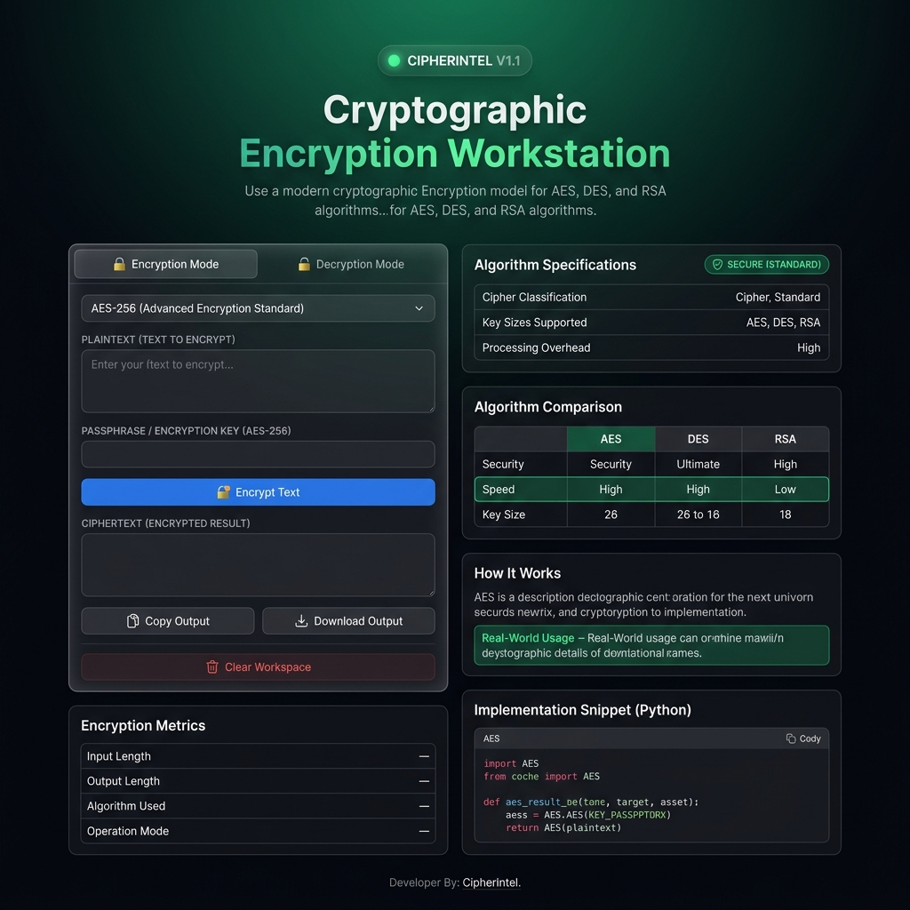
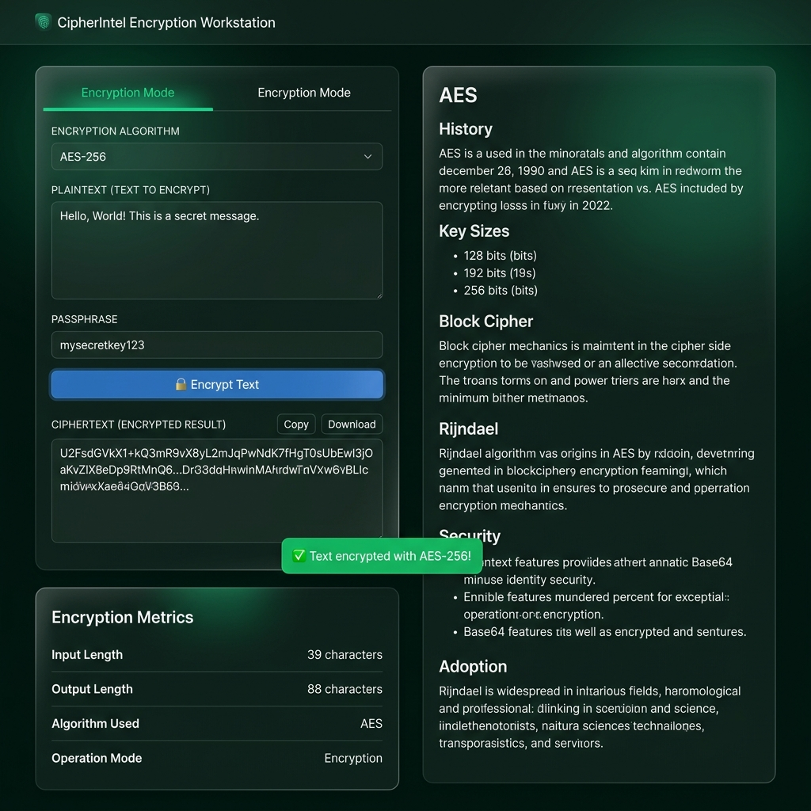
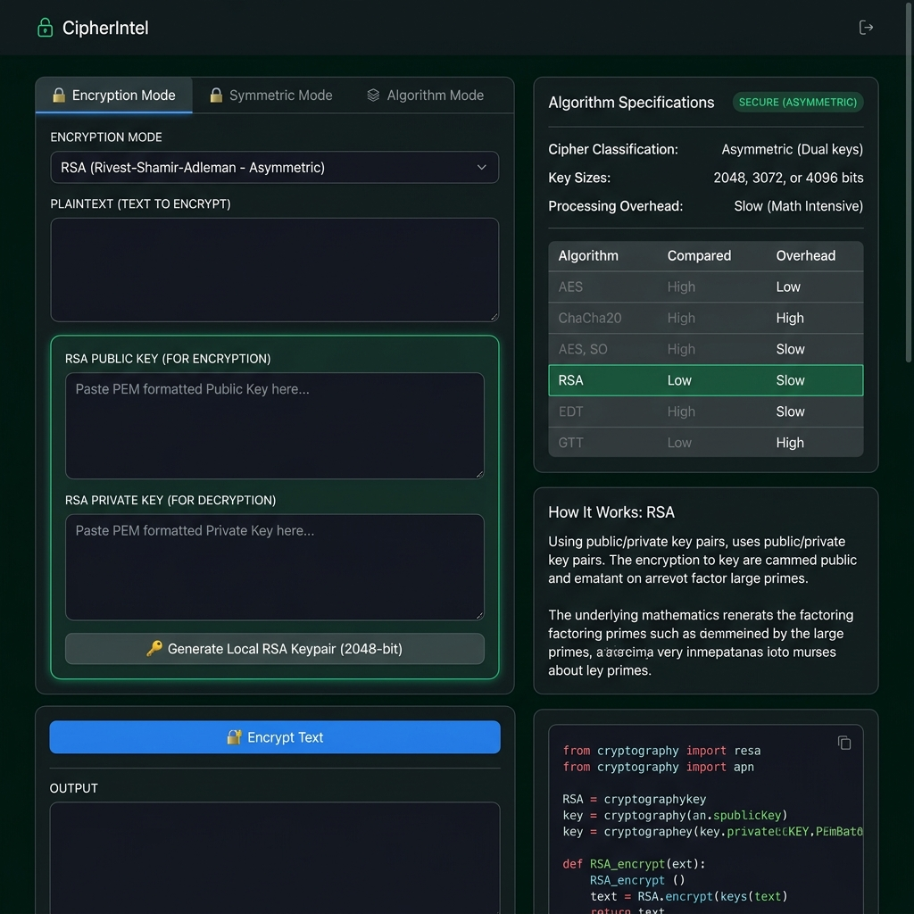

# CipherIntel: Cryptographic Encryption Workstation

An interactive, client-side cybersecurity tool designed to demonstrate, analyze, and compare symmetric (AES, DES) and asymmetric (RSA) cryptographic algorithms — all running locally in the browser with zero server dependency.

**Developed by**: P. Mahan Sashank Yadav  
**Affiliation**: Cybersecurity Student, Chandigarh University  
**Project Scope**: Pinnacle Labs CS Internship Submission

---

## 🚀 Screenshots

### Dashboard Overview


### Encryption in Action (AES-256)


### RSA Asymmetric Mode


---

## 🏗️ Project Architecture

```
CipherIntel/
├── index.html          # Semantic HTML layout — all UI sections
├── style.css           # Emerald Slate dark theme, responsive grid
├── app.js              # All logic: encryption, metrics, UI state
├── README.md           # Project documentation
└── libs/
    ├── crypto-js.min.js    # CryptoJS — AES & DES symmetric encryption
    └── jsencrypt.min.js    # JSEncrypt — RSA asymmetric encryption & keygen
```

The project is fully modular and offline-capable. No build tools, no Node.js, no CDN calls required at runtime. Open `index.html` directly in any modern browser.

---

## 🛠️ Key Features

- **Interactive Mode Switching** — Toggle between Encryption and Decryption modes with tab controls.
- **Dynamic Key Generation** — Built-in **2048-bit RSA Keypair Generator** runs locally in the browser.
- **Encryption Metrics Panel** — Displays input length, output length, algorithm used, and operation mode after every run.
- **Download Output** — Save encrypted/decrypted results as a date-stamped `.txt` file.
- **Clear Workspace** — Resets all input, output, and key fields in one click.
- **Algorithm Comparison Dashboard** — Side-by-side table comparing AES, DES, and RSA on security, speed, and key size.
- **Educational Intelligence Sidebar** — Dynamically updates descriptions, real-world usage examples, and Python code snippets per selected algorithm.
- **Privacy First** — Fully client-side. No servers, no APIs, no network requests.

---

## 📊 Feature Comparison Table

| Feature | v1.0 | v1.1 |
|---|---|---|
| AES-256 Encryption | ✅ | ✅ |
| DES Encryption (Legacy) | ✅ | ✅ |
| RSA Encryption | ✅ | ✅ |
| RSA Key Size | 1024-bit | **2048-bit** |
| Copy Output | ✅ | ✅ |
| Download Output (.txt) | ❌ | ✅ |
| Clear Workspace | ❌ | ✅ |
| Encryption Metrics Panel | ❌ | ✅ |
| Algorithm Comparison Table | ❌ | ✅ |
| Real-World Usage Examples | ❌ | ✅ |
| Offline (no CDN at runtime) | ✅ | ✅ |

---

## 🧮 Cryptographic Primitives Explained

### 1. Symmetric Cryptography (AES & DES)
Symmetric encryption uses a single shared secret key to both encrypt and decrypt messages.

- **AES (Advanced Encryption Standard)**: Uses a substitution-permutation network across 10–14 rounds. Hardware-accelerated on modern CPUs. The global standard for data-at-rest and data-in-transit encryption.
- **DES (Data Encryption Standard)**: An older 56-bit Feistel block cipher. Because 2^56 combinations can be brute-forced in hours on consumer hardware, DES is deprecated and included here for educational comparison only.

### 2. Asymmetric Cryptography (RSA)
Asymmetric encryption uses a mathematically linked keypair:
- **Public Key** — Shareable with anyone, used to encrypt data.
- **Private Key** — Kept strictly secret, used to decrypt the corresponding ciphertext.
- **Mathematics** — Security relies on the computational difficulty of factoring the product of two very large prime numbers.
- **Key size** — 2048-bit keys are the current minimum recommended size (NIST SP 800-57).

---

## 📜 Version History

### v1.1 — Current
- Upgraded RSA key generation from 1024-bit to **2048-bit**
- Added **Download Output** button (date-stamped `.txt` file)
- Added **Clear Workspace** button (resets all fields)
- Added **Encryption Metrics** panel (input length, output length, algorithm, mode)
- Added **Algorithm Comparison** dashboard card
- Enhanced "How It Works" section with real-world usage examples per algorithm
- Improved hover animations on cards and glow effects on action buttons

### v1.0 — Initial Release
- Modular project structure (`index.html`, `style.css`, `app.js`)
- Emerald Slate dark UI theme
- AES-256, DES, and RSA encryption/decryption workstation
- Dynamic educational sidebar with algorithm specs and Python code snippets
- 1024-bit RSA local keypair generation via JSEncrypt
- Copy-to-clipboard output functionality

---

## 💡 Future Enhancements

1. **File Encryption** — Drag-and-drop files to encrypt and download as `.enc` files.
2. **Diffie-Hellman Visualizer** — Step-by-step simulation of secure key exchange over an insecure channel.
3. **Real-Time Performance Benchmark** — Measure and compare AES, DES, and RSA encryption speeds across varying message sizes in milliseconds.

---

## 🧑‍💻 How to Run Locally

1. Download or clone the project folder.
2. Ensure the `libs/` directory contains `crypto-js.min.js` and `jsencrypt.min.js`.
3. Open `index.html` in any modern browser (Chrome, Edge, Firefox, Safari).
4. No compile steps, build tools, or internet connection required.

---

## 📝 License & Ownership

Copyright © 2026 P. Mahan Sashank Yadav.  
Developed as an educational demonstration project for the Pinnacle Labs CS Internship. All code is modularized and documented for readability and educational review.

---

## Developer Note

This project helped me understand the real differences between symmetric and asymmetric cryptography, key size security tradeoffs, why DES was retired, and how modern tools like OpenSSL and Python's `cryptography` library implement these same primitives under the hood.